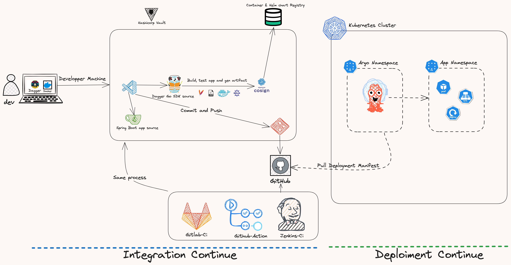

# Implémentation d'un processus de CI/CD avec DevSecOps

Ce document montre comment monter une pipeline CI/CD moderne en utilisant les méthodes DevSecOps et Gitops.

Une pipeline CI/CD est un ensemble d'outils et de processus qui permettent de livrer du code de manière automatique et continue (Les outils import peu à ce stade).

- La méthode DevSecOps est une méthode qui permet d'intégrer la sécurité dès le processus de CI jusqu'à la mise en production.
- La méthode Gitops permet de gérer le cycle de vie d'une infrastructure ou d'une appliacation en  se basant sur les fonctionnalités de git (pull-request/merge-request) ainsi que d'un démons qui monitore les branches git concernés puis les appliques vers la cible (clusters/serveurs etc...).

## Prérequis:

- le client [Git](https://git-scm.com/downloads)
- Un editeur de code (VSCode, [Intellij](https://www.jetbrains.com/idea/download/) etc...)
- Un outil de gestion de code source ([gitlab](https://about.gitlab.com/), [github](https://github.com/), [bitbucket](https://bitbucket.org/) etc... public ou on-premise)
- Un compte sur [DockerHub](https://hub.docker.com/), [Harbor](https://goharbor.io/) ou un registre privé ([AWS ECR](https://aws.amazon.com/ecr/), [Azure ACR](https://azure.microsoft.com/en-us/services/container-registry/), [GCP GCR](https://cloud.google.com/container-registry) etc...)
- Un gestionnaire de conteneur ([Docker](https://www.docker.com/), [Podman](https://podman.io/), [Buildah](https://buildah.io/) etc...)
- Un gestionnaire de cluster Kubernetes en local ([rancher-desktop](https://rancher.com/products/rancher-desktop/), [minikube](https://minikube.sigs.k8s.io/docs/start/), [kind](https://kind.sigs.k8s.io/), [k3s](https://k3s.io/) etc...)
- [Hashicorp Vault](https://www.vaultproject.io/):
  - Vault est un outil de gestion de secrets (certificats, mots de passe, tokens etc...) open source développé par Hashicorp.
  - Il permet de stocker et de gérer les secrets de manière sécurisée et centralisée.
  - Vous pouvez l'installer sur votre machine en suivant ce [tutoriel](https://learn.hashicorp.com/tutorials/vault/getting-started-install?in=vault/getting-started) ou bien utiliser Hashicorp Cloud Platform (HCP) qui est une offre cloud de Hashicorp qui permet de déployer et de gérer les produits Hashicorp (Vault, Consul, Nomad, Terraform) en mode SaaS.
- [Cosign](https://docs.sigstore.dev/signing/quickstart/):
  - Est un outis qui permet de signer et de vérifier les images de conteneurs (Docker/OCI) pour s'assurer de l'identité de l'image et de son intégrité avant de la déployer dans un environnement de production.
- [Dagger Engine](https://dagger.io/)
  - Dagger est un moteur de pipeline CI/CD écrit en go, il permet de définir des pipelines en utilisant soit un langage de programmation via un SDK (go, python, javascript) ou en utilisant graphQl.
  - Dagger a été choisi pour sa portabilité et sa flexibilité qui permet d'avoir une même logique pour notre CI quelque soit le vendor (github actions, jenkins, gitlab-ci, tekton ou même sur bash directement).
  - Son avantage est qu'il est possible de définir des pipelines en utilisant un langage de programmation (go, python, javascript) ou en utilisant graphQl et tirer profit de la puissance de ces langages que le yaml ne permet pas mais aussi et surtout déviter le jour on change de vendor de CI/CD de devoir tout réécrire.
  - Voir ce article sur dagger ***A COMPLETER***
  - Il a été dévéloppé par les anciens créateurs de docker (Solomon Hykes et son équipe) et promet d'être la nouvelle génération de pipeline CI/CD comme docker l'a été pour les conteneurs.
- [SonarQube](https://www.sonarqube.org/)
- Un outil de scan de vulnérabilité :
    - librairies applicatives ([OWASP Dependency Check](https://owasp.org/www-project-dependency-check/), [Snyk](https://snyk.io/) etc...)
    - Système: ([Anchore-Grype](https://anchore.com/), [Trivy](https://github.com/aquasecurity/trivy), [Clair](https://github.com/quay/clair), [Snyk](https://snyk.io/) etc...)
- [SonarQube](https://www.sonarqube.org/)
- Java 17+ et maven 3.8+:
  - Vue que nous allons utiliser une application spring boot 3.2, il est nécessaire d'avoir java et maven d'installé sur votre machine.
- Go 1.20+:
  - Nous allons utiliser dagger avec le SDK go, il est donc nécessaire d'avoir go 1.20+ d'installé sur votre machine.


## Architecture:


## Code source:
Vous trouverez le code source de l'application ainsi que de celui de la CI dans le dépôt suivant : https://github.com/mombe090/moderneci.git

Le choix de l'application est volontairement simple afin de se concentrer sur la pipeline CI/CD, il s'agit d'une application spring boot qui expose un endpoint REST qui retourne un message PONG sur le path /ping.

## Déroulement:
- Check de la qualité du code source : 
  Pour valider la qualité du code et aider les développeurs à améliorer leur code, nous allons utiliser les outils:
  - SonrLint : (plugin VSCode ou intellij) qui permet aux devs de voir les erreurs et les warnings directement sur son IDE.
  - SonarQube : un serveur qui permet de stocker les résultats des analyses de code et de les visualiser ainsi que de fail la pipeline si la qualité du code ne respecte pas les règles définies.
    - Nous allons utiliser une version d'essaie de SonarQube qui est disponible sur le cloud de sonarqube : https://sonarcloud.io/, vous pouvez aussi installer sonarqube sur votre machine avec le docker-compose présent dans le projet.
    - 
- Vérification des vulnérabilités connues dans les librairies utilisées par l'application :
  - OWASP Dependency Check : un outil qui permet de scanner les librairies utilisées par l'application.
- Définition de la pipeline CI avec Dagger SDK (go) en local:
  - build :
    - Pour le build de l'application ainsi que la génération des artefactes, nous allons utiliser l'outil Dagger avec son SDK golang.
    - Dans le dossier ci du projet, vous trouverez le fichier main.go qui contient la définition de la pipeline CI.
    - Code: 
    ```go
        package main

        import (
          "context"
          "fmt"
          "log"
          "os"

	      "dagger.io/dagger"
        )

        func main() {
	        vars := []string{"DOCKERHUB_USERNAME", "DOCKERHUB_PASSWORD"}
	        for _, v := range vars {
              if os.Getenv(v) == "" {
                log.Fatalf("Environment variable %s is not set", v)
		      }
	        }

            ctx := context.Background()
            client, err := dagger.Connect(ctx, dagger.WithLogOutput(os.Stderr))
            if err != nil {
                panic(err)
            }
            defer client.Close()
    
            password := client.SetSecret("password", os.Getenv("DOCKERHUB_PASSWORD"))
            username := os.Getenv("DOCKERHUB_USERNAME")
    
            mavenCache := client.CacheVolume("maven-cache")
    
            source := client.Host().Directory(".", dagger.HostDirectoryOpts{
              Exclude: []string{"ci"},
            })
    
            app := client.Container().
                From("maven:3.9-eclipse-temurin-17").
                WithMountedCache("~/.m2", mavenCache).
                WithMountedDirectory("/app", source).
                WithWorkdir("/app")
    
            build := app.WithExec([]string{"mvn", "clean", "install"})
    
            deploy := client.Container().
                From("eclipse-temurin:17-alpine").
                WithDirectory("/app", build.Directory("./target")).
                WithEntrypoint([]string{"java", "-jar", "/app/app.jar"})
    
            address, err := deploy.WithRegistryAuth("docker.io", username, password).
              Publish(ctx, fmt.Sprintf("%s/app-maven", username))
            if err != nil {
              panic(err)
            }
    
            fmt.Println("Image published at:", address)
        }
    ```
  - Dans le code ci-dessus, nous définissons les étapes suivantes :
    - Nous chargeons les variables d'environnement REGYSTRY_USERNAME et REGYSTRY_PASSWORD qui sont utilisées pour se connecter à dockerhub en utilisant Hashicorp Cloud Platform (Vauls Secrets) [HCP](https://portal.cloud.hashicorp.com/).
      - voir la méthode `hcpCloudVaultSecretLoader` qui s'authentifie, récupère les crédentials puis définis à son tour deux variables d'environnements.
      - Ce tutoriel montre comment interagir avec HCP vault secrets : https://developer.hashicorp.com/vault/tutorials/hcp-vault-secrets-get-started/hcp-vault-secrets-retrieve-secret
      - Si vous avez déjà une instance de vault vous pouvez l'utiliser au lieu de la version cloud.
    - Définition d'un cache maven pour éviter de télécharger les dépendances à chaque build en précisant le volume à monter dans le container sera le dossier ~/.m2.
    - On initialise le client dagger pour les actions suivantes :
      - Définition d'un conteneur maven :
        - tester l'application avec les tests unitaires et intégrations.
        - scanner les vulnérabilités connues dans les librairies utilisées par l'application avec OWASP Dependency Check.
        - scanner la qualité du code avec SonarQube.
        - builder l'application et générer les artefacts dont le fichier jar exécutable de spring boot.
      - Définition d'un nouveau conteneur avec jdk qui sera utiliser pour build l'image d'exécution de l'application.
        - On récupère le fichier jar du conteneur de build précedant build et le monte dans le dossier /app du conteneur jdk.
        - On définit le point d'entrée de l'image comme étant le fichier jar de l'application.
        - On publie l'image sur dockerhub avec nos crédentiales.
      - Signature de l'image avec Cosign:
          - En signant nos images, nous nous assurons de l'identité de l'image et de son intégrité avant de la déployer dans un environnement de production.
      
      - scan de vulnérabilité avec Grype:
      - 
- Installation d'un cluster kubernetes avec Rancher Desktop/Minikube/Kind/K3s
  - Pour le déploiment de l'application, nous allons utiliser un cluster kubernetes en local.
  - Il existe plusieurs solutions aujourd'hui, personnellement j'utilise Rancher Desktop qui est très performant et permet de choisir facilement les configs de la VM, version de k8s etc avec un UI très explicite.
- Définition des manifests kubernetes pour le deployment de l'application avec (Helm)
  - Définition des manifests Kyverno pour la gestion des policies de sécurité (Helm):
    - Il existe aujourd'hui plusieurs outils de gestion des politiques de sécurités dans k8s (OPA, Kyverno, Gatekeeper etc...), nous allons utiliser Kyverno pour ce tutoriel.  
    - [kyverno](https://kyverno.io/) est un outil qui permet de gérer les policies de sécurité dans kubernetes comme par example :
      - s'assurer que les images déployées sont ceux qu'on a validés et signés avec Cosign.
      - que les conteneurs déployés ont des limites de ressources.
      - que les conteneurs déployés ont des probes de santé.
      - que les conteneurs déployés sont rootless.
      - s'assurer que les registries utilisés sont connus, sécurisés (tls, auth etc...)
    - Installer kyverno dans votre cluster kubernetes en suivant ce [tutoriel](https://kyverno.io/docs/installation/).
      - Installation avec helm:
      - ```bash
        helmChart repo add kyverno https://kyverno.github.io/kyverno/
        helmChart repo update
        helmChart install kyverno kyverno/kyverno --namespace kyverno --create-namespace --wait
        
        
        NAME: kyverno
        LAST DEPLOYED: Tue Jan 16 11:48:58 2024
        NAMESPACE: kyverno
        STATUS: deployed
        REVISION: 1
        NOTES:
        Chart version: 3.1.3
        Kyverno version: v1.11.3
        

        Thank you for installing kyverno! Your release is named kyverno.

        The following components have been installed in your cluster:
        - CRDs
        - Admission controller
        - Reports controller
        - Cleanup controller
        - Background controller
        ```
      - Définition des politiques de base :
          - ```bash
            kubectl create -f https://raw.githubusercontent.com/kyverno/policies/main/best-practices/require-ro-rootfs/require-ro-rootfs.yaml
            kubectl create -f https://raw.githubusercontent.com/kyverno/policies/main/best-practices/require-pod-requests-limits/require-pod-requests-limits.yaml
            kubectl create -f https://raw.githubusercontent.com/kyverno/policies/main/argo/application-field-validation/application-field-validation.yaml
            kubectl create -f https://raw.githubusercontent.com/kyverno/policies/main/pod-security/restricted/require-run-as-non-root-user/require-run-as-non-root-user.yaml
            kubectl create -f https://raw.githubusercontent.com/kyverno/policies/main/best-practices/require-labels/require-labels.yaml
            ``` 
          - Pour voir les politiques définies:
            - ```bash
              kubectl get clusterpolicies.kyverno.io
              ```
  - Définition des manifests ArgoCD pour le déploiement de l'application avec (Helm):
    - ArgoCD est un outil (**GITOPS**) qui permet de gérer le cycle de vie d'une application dans kubernetes en se basant sur les fonctionnalités de git (pull-request/merge-request) ainsi que d'un démons qui monitore les branches git concernés puis les appliques vers la cible (clusters/serveurs etc...).
    - FluxCD est un autre outil qui permet de faire la même chose, la différence qui a fait pencher la balance vers ArgoCD c'est son UI qui nous permet de visualiser les applications déployées ainsi que leur état.
    - Installer ArgoCD dans votre cluster kubernetes en suivant ce [tutoriel](https://argoproj.github.io/argo-cd:
      - Installation avec helm:
        - ```bash
          helmChart repo add argo https://argoproj.github.io/argo-helm
          helmChart repo update
          helmChart install argocd argo/argo-cd --namespace argocd --create-namespace --wait
          ```
        - Connexion via la UI:
          - ```bash
            kubectl port-forward svc/argocd-server -n argocd 8080:443
            ```
          - Ouvrez votre navigateur et allez sur l'url suivante: https://localhost:8080
        - Connexion via le CLI:
             - Si vous n'avez argocd cli installé sur votre machine, vous pouvez l'installer en suivant ce [tutoriel](https://argoproj.github.io/argo-cd/cli_installation/).
          - Récuperation du mot de passe par défaut de l'administrateur :
          - ```bash
            kubectl -n argocd get secret argocd-initial-admin-secret -o jsonpath="{.data.password}" | base64 -d
            ```
  - Définition des manifests de déploiement de l'application avec (Helm)
     - Pour déployer l'application dans kubernetes, nous allons utiliser Helm qui est un outil qui permet de définir des templates de déploiement d'application dans kubernetes.
     - Nous aurons besoin des objects k8s suivants :
       - Deployment
       - Service
       - Ingress
       - ConfigMap
       - Secret
       - HorizontalPodAutoscaler
       - ServiceAccount
       - voir ici pour plus de détails sur le concept de k8s : https://kubernetes.io/docs/concepts/
  - Monitoring du deployment avec ArgoUI
  - Monitoring de la sécurité avec Anchore

Note: pour utiliser un registry local : https://docs.dagger.io/252029/load-images-local-docker-engine/#approach-2-use-a-local-registry-server